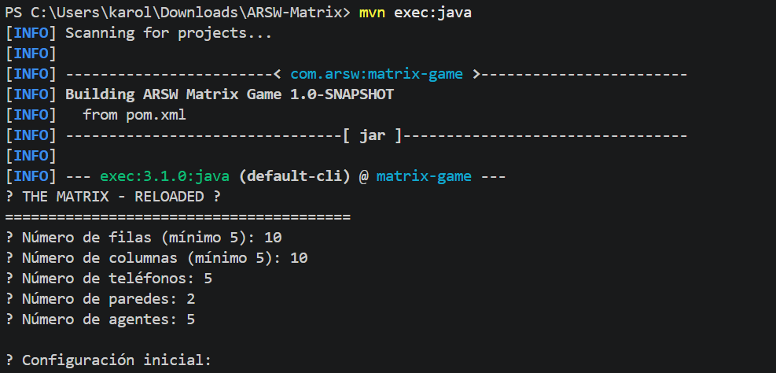
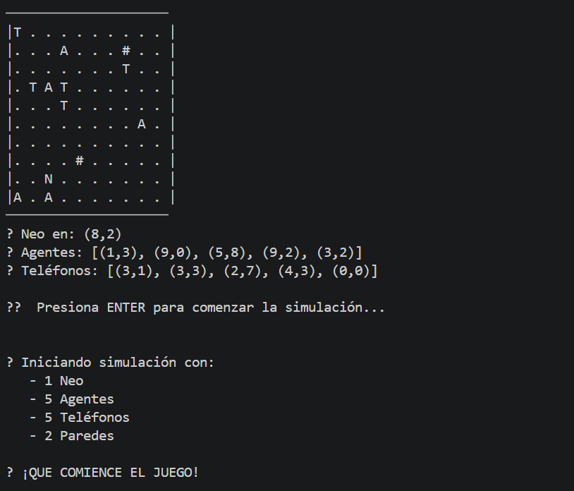
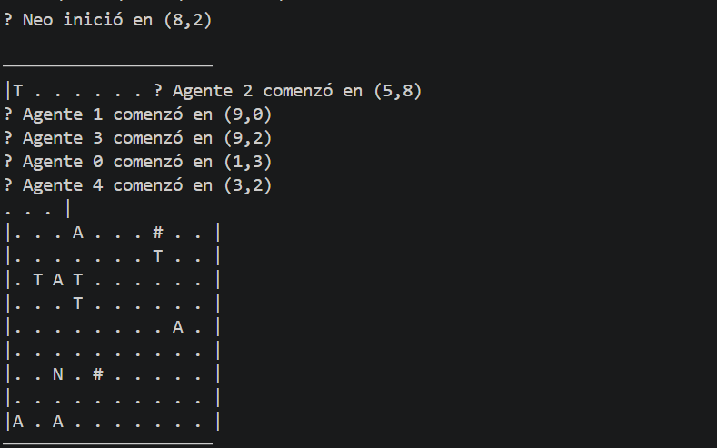
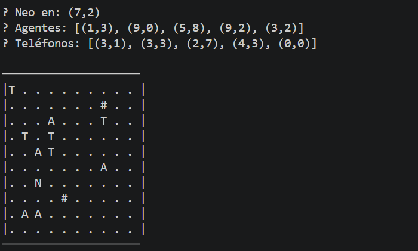
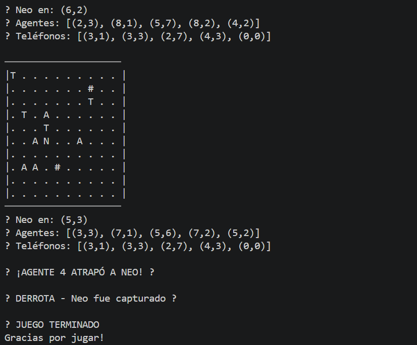

# ARSW-Matrix

## Juego de hilos: Neo vs Agentes

Proyecto Java en Maven que simula un tablero `N x M` con:

- `Neo` moviéndose hacia el teléfono más cercano.
- `Agentes` persiguiendo a Neo.
- `Paredes` como obstáculos inamovibles.
- `Teléfonos` colocados aleatoriamente.

## Ejecutar

1. Compilar:
   ```bash
   mvn compile
   ```

2. Ejecutar:
   ```bash
   mvn exec:java
   ```

3. Responde en consola:
   - filas
   - columnas
   - teléfonos
   - paredes
   - agentes

## Estructura del proyecto

- `pom.xml`
- `src/main/java/arsw/Main.java`
- `src/main/java/arsw/Board.java`
- `src/main/java/arsw/Neo.java`
- `src/main/java/arsw/Agent.java`
- `src/main/java/arsw/Position.java`
- `src/main/java/arsw/GameState.java`
- `src/main/java/arsw/Phone.java`
- `src/main/java/arsw/Wall.java`

### Pruebas





